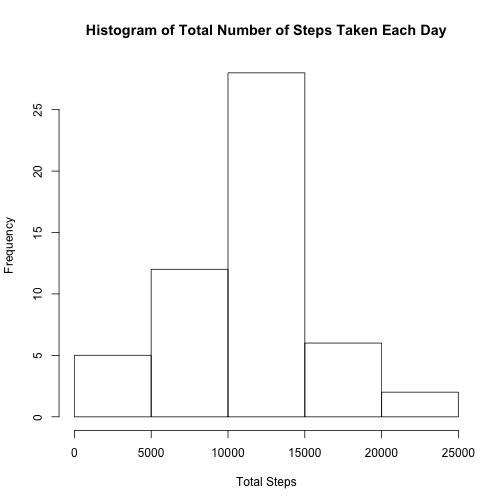
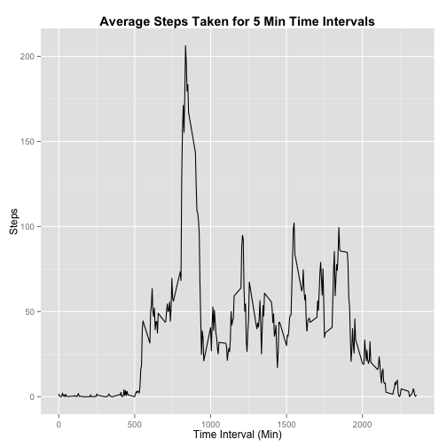
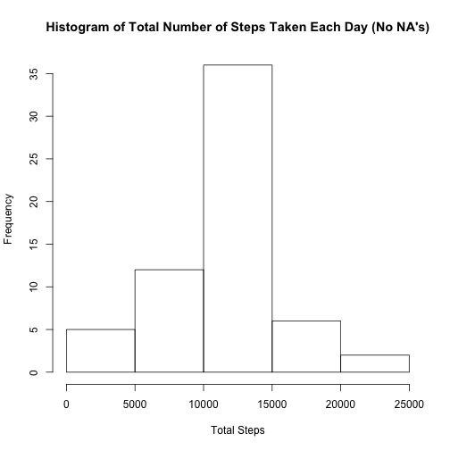
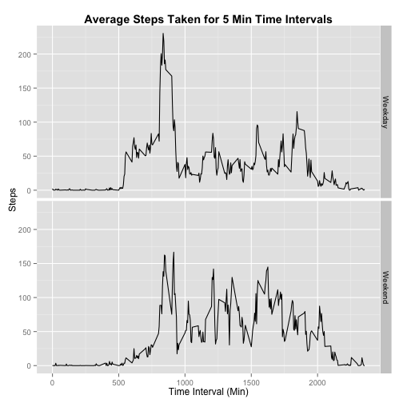

Course Project 1
-----------------------------------

Load in the necessary pacakges in R that I will be using. (I used the 'results = "hide"' option but for some reason I cannot get knitr to not show loading in the **dplyr** package)

```r
library(dplyr)
library(lubridate)
library(ggplot2)
```

Unzip the data file and then read in the data and then remove all the missing values and add a new column that changes the date column from a factor class to a time (POSIXct and POSIXt) class and save this new data frame under the variable **data1**


```r
unzip("activity.zip")
data <- read.csv("activity.csv")
data1 <-data %>%
  filter(!is.na(steps)) %>% 
  mutate(time = ymd(date)) 
```

Calculate the number of steps taken each day and save that under a new variable called **steps**. Then make a histogram based on the **steps** variable. Using the **steps** variable, I also calculate the mean and median of the total steps taken each day. 


```r
steps <-
  data1 %>% group_by(date) %>%
  summarize(total_steps = sum(steps))
hist(steps$total_steps, main = "Histogram of Total Number of Steps Taken Each Day", xlab = "Total Steps")
```

 

```r
total_steps_mean <- as.integer(mean(steps$total_steps))
total_steps_median <- median(steps$total_steps)
```

The **mean** of the total steps taken each day is **10766** (rounded to the nearest whole number) and the **median** of the total steps taken each day is **10765**.

Making a time series plot based on the different intervals for each day


```r
steps_by_time <-
  data1 %>% group_by(interval) %>%
  summarize(avg_steps = mean(steps))
g <- ggplot(steps_by_time, aes(x = interval, y = avg_steps)) + 
  geom_line() + xlab("Time Interval (Min)") + ylab("Steps") +
  ggtitle("Average Steps Taken for 5 Min Time Intervals") +
  theme(plot.title = element_text(face="bold"))
print(g)
```

 

```r
max_steps <- max(steps_by_time$avg_steps)
max_steps_time <-
  steps_by_time %>% filter(avg_steps >= max_steps)
```

On average across all days, the 5 minute interval that contains the **maximum number of steps** is the **835th** interval

I first calculate the total number of missing values in the original data set and then I fill in the missing values with the average steps taken from all the other days based on the time interval and save that new data frame under the variable **data_noNA**.

```r
totalNA <- sum(is.na(data))
count <- -1
data_noNA <- data
for (i in 1:nrow(data_noNA)) {
  if (data_noNA[i,3] == 0) {
    count <- count + 1
  }
  if (is.na(data_noNA[i,1])){
    data_noNA[i,1] <- steps_by_time[i-nrow(steps_by_time)*count,2]
  }
}
```

There are a total of **2304** missing values (NA's) in the original dataset. 

Making a histogram of total number of steps taken with missing values filled in and then calculating the mean and median of the total steps taken each day from the new data frame


```r
steps_all_data <-
  data_noNA %>% group_by(date) %>%
  summarize(total_steps = sum(steps))
hist(steps_all_data$total_steps, main = "Histogram of Total Number of Steps Taken Each Day (No NA's)", xlab = "Total Steps")
```

 

```r
total_steps_mean_all_data <- as.integer(mean(steps_all_data$total_steps))
total_steps_median_all_data <- as.integer(median(steps_all_data$total_steps))
```

The **mean** of the total steps taken each day is **10766** (rounded to the nearest whole number) and the **median** of the total steps taken each day is **10766** (rounded to the nearest whole number). These values are basically similar to the values estimated from the first part of the assignment. By imputing the missing data, the total daily number of steps do not have any significant difference from the original estimates and this is because I added in the average data for the missing values based on the time interval and so by doing this I do not actually change the day-to-day values when looking at the whole time period at once. 

Using the **data_noNA** variable, I first make a new column that is the time class equivalent to the date column, and using this new column I make another column that has the factor levels weekday and weekend


```r
data_noNA <- 
  data_noNA %>% mutate(time = ymd(date)) %>% 
  mutate(dayofweek = weekdays(time))
for (i in 1:nrow(data_noNA)) {
  if (data_noNA[i,5] == "Saturday" | data_noNA[i,5] == "Sunday") {
    data_noNA[i,5] = "Weekend"
  }
  else {
    data_noNA[i,5] = "Weekday"
  }
}

data_noNA$dayofweek <- as.factor(data_noNA$dayofweek)

steps_by_weekday <-
  data_noNA %>% group_by(dayofweek, interval) %>%
  summarize(avg_steps = mean(steps))

g <- ggplot(steps_by_weekday, aes(x = interval, y = avg_steps)) + geom_line() + facet_grid(dayofweek ~ .) + 
  xlab("Time Interval (Min)") + ylab("Steps") +
  ggtitle("Average Steps Taken for 5 Min Time Intervals") +
  theme(plot.title = element_text(face="bold"))
print(g)
```

 

